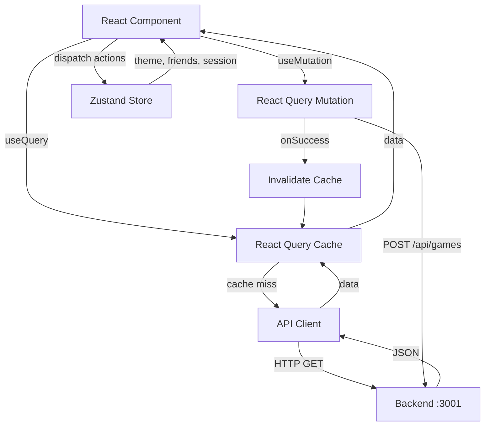
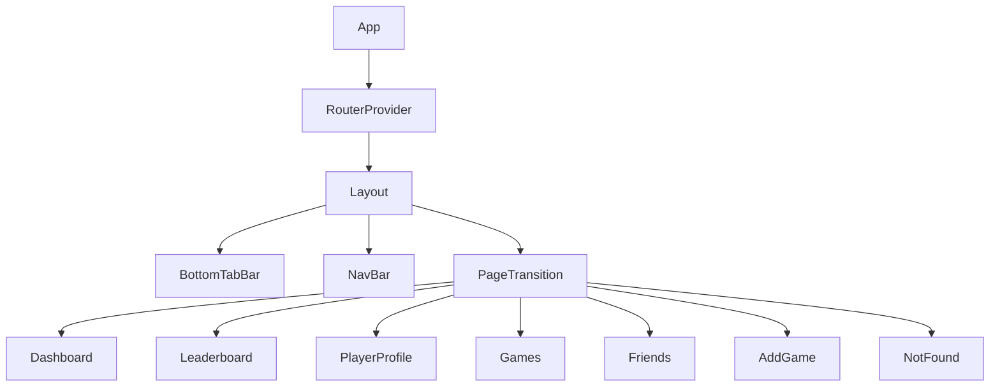

# Design Document: Pickleball Frontend

## Overview

The Pickleball Tracking frontend is a mobile-first React web application that connects to an existing Node.js/Express/MongoDB backend. It provides a rich, animated UI for tracking pickleball games, viewing player standings, managing a social friends network, and logging new matches.

The frontend lives at `/Users/Hari/Desktop/pickleball_app/frontend/` and is completely decoupled from the backend — it communicates exclusively through REST API calls to `http://localhost:3001/api`. Since the backend currently exposes only `GET /api/players` and `GET /api/games`, friend request state and any write operations (POST /api/games) will need the appropriate backend route added, and friend requests will be managed client-side in Zustand.

**Tech stack:**
- React 18 + Vite (TypeScript)
- Tailwind CSS (custom pickleball theme)
- React Router v6
- React Query v5 (TanStack Query)
- Zustand v4
- Framer Motion v11
- Lucide React

---

## Architecture

### High-Level Structure

```
frontend/
├── public/
│   └── assets/          # Static assets (SVG illustrations, favicon)
├── src/
│   ├── api/             # API client functions (axios/fetch wrappers)
│   ├── components/      # Shared, reusable UI components
│   │   ├── common/      # Button, Input, Badge, Avatar, Toast, Skeleton
│   │   ├── layout/      # BottomTabBar, NavBar, PageTransition, Layout
│   │   └── cards/       # PlayerCard, GameCard, StatCard
│   ├── features/        # Screen-level feature modules
│   │   ├── dashboard/
│   │   ├── leaderboard/
│   │   ├── profile/
│   │   ├── games/
│   │   ├── friends/
│   │   └── add-game/
│   ├── hooks/           # Custom React hooks (useTheme, useGeolocation, etc.)
│   ├── store/           # Zustand stores (theme, friends, session)
│   ├── types/           # TypeScript type definitions
│   ├── lib/             # Utility functions (formatters, validators, etc.)
│   ├── router/          # React Router configuration
│   ├── App.tsx
│   └── main.tsx
├── tailwind.config.ts
├── vite.config.ts
└── tsconfig.json
```

### Data Flow



### Component Hierarchy



---

## Components and Interfaces

### TypeScript Types (`src/types/index.ts`)

```typescript
export interface Player {
  _id: string;
  uid: string;
  displayName: string;
  avatarURL?: string;
  rankScore: number;       // default 1500
  gamesPlayed: number;     // default 0
  winRate: number;         // 0.0 – 1.0, default 0.5
  createdAt: string;       // ISO date string
}

export interface Score {
  homeTeam: number;
  awayTeam: number;
}

export interface GeoPoint {
  type: 'Point';
  coordinates: [number, number]; // [longitude, latitude]
}

export interface Game {
  _id: string;
  players: string[];       // array of UIDs
  location: GeoPoint;
  timestamp: string;       // ISO date string
  score: Score;
  mediaURL?: string;
  createdAt: string;       // ISO date string
}

export interface FriendRequest {
  id: string;              // client-generated UUID
  senderUID: string;
  receiverUID: string;
  status: 'pending' | 'accepted';
  createdAt: string;       // ISO date string
}

export type Theme = 'light' | 'dark';

export type SortKey = 'rankScore' | 'winRate' | 'gamesPlayed';
```

### API Client (`src/api/`)

```typescript
// src/api/players.ts
export const getPlayers = (): Promise<Player[]> =>
  fetch('/api/players').then(r => { if (!r.ok) throw new Error(r.statusText); return r.json(); });

// src/api/games.ts
export const getGames = (): Promise<Game[]> =>
  fetch('/api/games').then(r => { if (!r.ok) throw new Error(r.statusText); return r.json(); });

export const createGame = (payload: Omit<Game, '_id' | 'createdAt'>): Promise<Game> =>
  fetch('/api/games', {
    method: 'POST',
    headers: { 'Content-Type': 'application/json' },
    body: JSON.stringify(payload),
  }).then(r => { if (!r.ok) throw new Error(r.statusText); return r.json(); });
```

### Zustand Stores (`src/store/`)

```typescript
// src/store/themeStore.ts
interface ThemeStore {
  theme: Theme;
  setTheme: (theme: Theme) => void;
  toggleTheme: () => void;
}

// src/store/friendsStore.ts
interface FriendsStore {
  requests: FriendRequest[];
  sendRequest: (senderUID: string, receiverUID: string) => void;
  acceptRequest: (id: string) => void;
  rejectRequest: (id: string) => void;
}

// src/store/sessionStore.ts
interface SessionStore {
  currentUID: string;
  setCurrentUID: (uid: string) => void;
}
```

### React Query Keys

```typescript
// src/lib/queryKeys.ts
export const QUERY_KEYS = {
  players: ['players'] as const,
  games: ['games'] as const,
};
```

### Shared Components

| Component | Props | Purpose |
|---|---|---|
| `<PlayerCard>` | `player: Player`, `rank?: number` | Leaderboard / search list item |
| `<GameCard>` | `game: Game` | Game list item with score display |
| `<StatCard>` | `title`, `value`, `icon` | Glassmorphism hero stat tile |
| `<Avatar>` | `src?`, `name`, `size` | Player avatar with initials fallback |
| `<SkeletonLoader>` | `variant: 'card' \| 'list' \| 'profile'` | Animated loading placeholder |
| `<Toast>` | managed by Zustand + hook | Notification overlay |
| `<BottomTabBar>` | - | Mobile primary nav |
| `<NavBar>` | - | Desktop top/side nav |
| `<PageTransition>` | `children` | Framer Motion route wrapper |
| `<EmptyState>` | `icon`, `title`, `description` | Zero-data placeholder |

---

## Data Models

### Computed / Derived Data

Since the backend returns raw data, all derived values are computed client-side:

| Derived Value | Source | Computation |
|---|---|---|
| Leaderboard rank | `players` array sorted by `rankScore` desc | `index + 1` after sort |
| Win rate display | `player.winRate` | `Math.round(winRate * 100)` + `%` |
| Player game history | `games` array filtered | `games.filter(g => g.players.includes(uid))` |
| Top player | `players` sorted by `rankScore` | `players[0]` after sort |
| Recent games | `games` sorted by `createdAt` | `games.slice(0, 5)` after sort desc |
| Top 5 players | `players` sorted by `rankScore` | `players.slice(0, 5)` |

### Friend Request State (Client-Side)

Friend requests are fully managed in Zustand with `localStorage` persistence. The `friendsStore` is persisted via Zustand's `persist` middleware.

### Add Game Form State

Form state is managed with React's `useState` (or `useReducer`). On successful submission, the React Query `['games']` cache is invalidated to trigger a background refetch.

---

## Correctness Properties

*A property is a characteristic or behavior that should hold true across all valid executions of a system — essentially, a formal statement about what the system should do. Properties serve as the bridge between human-readable specifications and machine-verifiable correctness guarantees.*

### Property 1: Tab Navigation Routing

*For any* tab in the BottomTabBar (or NavBar on desktop), clicking that tab should navigate the router to the correct corresponding route path, and the active visual indicator should be applied to that tab and only that tab.

**Validates: Requirements 2.2, 2.3**

---

### Property 2: Theme Toggle Propagation

*For any* theme value ("dark" or "light"), when the Zustand theme store is set to that value, the `<html>` root element should have the corresponding CSS class ("dark" or "light") applied immediately.

**Validates: Requirements 3.1, 3.2**

---

### Property 3: Theme Persistence Round-Trip

*For any* theme value ("dark" or "light"), setting the theme in the Zustand store should persist that value to `localStorage` under the correct key, and initializing the store from a fresh state should restore that exact value.

**Validates: Requirements 3.3, 3.4**

---

### Property 4: Dashboard Hero Stats Computation

*For any* non-empty array of Player objects, the hero stats section should display the exact count of players, the exact count of games, and the `displayName` and `rankScore` of the player with the maximum `rankScore`.

**Validates: Requirements 4.2**

---

### Property 5: Dashboard Leaderboard Preview Top-N

*For any* array of players (including those with fewer than 5 entries), the leaderboard preview should display exactly `min(5, players.length)` players, and the displayed players should be the ones with the highest `rankScore` values, sorted descending.

**Validates: Requirements 4.3**

---

### Property 6: Dashboard Recent Games Top-N

*For any* array of games (including those with fewer than 5 entries), the recent games feed should display exactly `min(5, games.length)` games, and the displayed games should be the most recently created ones, sorted by `createdAt` descending.

**Validates: Requirements 4.4**

---

### Property 7: Player List Sort Order

*For any* array of Player objects and any valid sort key (`rankScore`, `winRate`, or `gamesPlayed`), the rendered player list should be sorted in descending order by that sort key, with no player omitted and no player added.

**Validates: Requirements 5.2, 5.5**

---

### Property 8: PlayerCard Complete Field Rendering

*For any* valid Player object, the rendered `<PlayerCard>` should contain the player's rank position, `displayName`, `rankScore`, `winRate` formatted as a percentage, and `gamesPlayed` — all within the DOM.

**Validates: Requirements 5.3**

---

### Property 9: Leaderboard Search Filter Correctness

*For any* case-insensitive search query string and any array of Player objects, the filtered results should contain exactly the players whose `displayName` contains the query (case-insensitive), and no player that matches should be excluded.

**Validates: Requirements 5.4**

---

### Property 10: Player Profile Game History Filter

*For any* player UID and any array of Game objects, the player profile's game history should display exactly the games where that UID appears in the `players` array, sorted by `timestamp` descending, with no game omitted or incorrectly included.

**Validates: Requirements 6.4**

---

### Property 11: GameCard Complete Field Rendering

*For any* valid Game object, the rendered `<GameCard>` should contain the score, a formatted timestamp, a location indicator, and — if `mediaURL` is present — a media element. No required field should be absent.

**Validates: Requirements 7.3, 7.4**

---

### Property 12: Friend Request List Correctness

*For any* Zustand friends store state and current user UID:
- The accepted friends list should contain exactly the FriendRequests with `status === "accepted"` where `senderUID` or `receiverUID` equals the current user UID.
- The pending list should contain exactly the FriendRequests with `status === "pending"` where `receiverUID` equals the current user UID.
- After accepting any pending request, that request's status should become "accepted" and it should move to the friends list.
- After rejecting any pending request, that request should be removed from the store entirely.

**Validates: Requirements 8.2, 8.3, 8.4, 8.5**

---

### Property 13: Form Validation Prevents Invalid Submission

*For any* combination of Add Game form field values, the form should not invoke the POST `/api/games` API call if: fewer than 2 players are selected, or either score field contains a negative number or non-integer, or no valid geolocation has been obtained. For each invalid state, at least one inline error message should be rendered.

**Validates: Requirements 9.3, 9.4**

---

### Property 14: Duplicate Friend Request Prevention (Idempotence)

*For any* pair of UIDs `(senderUID, receiverUID)`, attempting to send a second friend request between the same pair (in either direction) when one already exists should not create a duplicate entry in the Zustand store, and an informational message should be displayed.

**Validates: Requirements 8.8**

---

## Error Handling

### API Error Handling

React Query's `onError` callback and `error` state handle all API failures. Each screen that fetches data renders an inline error component when `isError === true`.

```typescript
// Pattern used across all query-dependent screens
const { data, isLoading, isError, refetch } = useQuery({
  queryKey: QUERY_KEYS.players,
  queryFn: getPlayers,
});

if (isError) return <ErrorState onRetry={refetch} />;
```

The `<ErrorState>` component accepts an `onRetry` prop that calls `refetch()` from the query hook, fulfilling the retry requirement.

### Form Error Handling

The Add Game form uses a multi-level validation strategy:
1. **Field-level**: Errors displayed under each field immediately on blur.
2. **Submit-level**: Full validation run on submit; if any field is invalid, submission is blocked and all errors are shown.
3. **API-level**: On mutation error, a Toast is shown with the error message, and the form remains populated.

### Geolocation Error Handling

```typescript
// src/hooks/useGeolocation.ts
type GeolocationState =
  | { status: 'idle' }
  | { status: 'loading' }
  | { status: 'success'; coords: GeolocationCoordinates }
  | { status: 'error'; message: string };
```

When `status === 'error'`, the form renders the inline error message and unlocks a manual coordinate entry fallback (two number inputs for latitude and longitude).

### 404 / Not Found

A `<NotFound>` component is rendered for any unregistered route via React Router's wildcard `<Route path="*">`. It contains a home button navigating back to `/`.

### Toast Notification System

Toasts are driven by a simple Zustand `toastStore` that holds a queue of `{ id, message, type: 'success' | 'error' | 'info' }`. A `<ToastContainer>` component reads this store and renders toasts with auto-dismiss (3 seconds) and an `aria-live="polite"` region for screen reader announcements.

---

## Testing Strategy

### Dual Testing Approach

Both unit/example tests and property-based tests are used for comprehensive coverage. Unit tests handle specific scenarios and edge cases; property-based tests validate universal correctness properties across randomized inputs.

### Testing Stack

- **Test runner**: Vitest
- **Component testing**: React Testing Library (`@testing-library/react`)
- **Property-based testing**: `fast-check` (PBT library for TypeScript)
- **Mocking**: Vitest's built-in mock utilities + `msw` (Mock Service Worker) for API mocking

### Property-Based Test Configuration

- Minimum **100 iterations** per property test (fast-check default: 100 runs)
- Each property test is tagged with a comment referencing the design property number
- Tag format: `// Feature: pickleball-frontend, Property N: <property_text>`

### Unit Test Coverage Targets

| Area | Type | What's Tested |
|---|---|---|
| API functions | Unit | Correct URL construction, error propagation |
| Data utilities | Unit + PBT | Sorting, filtering, formatting functions |
| Zustand stores | Unit + PBT | State transitions, persistence |
| UI Components | Unit (RTL) | Rendering, user interactions |
| Form validation | Unit + PBT | Validation logic across input space |
| Routing | Unit | Correct route→component mapping |

### Property Tests (one per design property)

Each of the 14 Correctness Properties maps to exactly one `fast-check` property test:

| Property | Test File | fast-check Arbitrary |
|---|---|---|
| P1: Tab navigation routing | `BottomTabBar.test.tsx` | `fc.constantFrom(...tabRoutes)` |
| P2: Theme toggle propagation | `themeStore.test.ts` | `fc.constantFrom('dark', 'light')` |
| P3: Theme persistence round-trip | `themeStore.test.ts` | `fc.constantFrom('dark', 'light')` |
| P4: Dashboard hero stats | `Dashboard.test.tsx` | `fc.array(playerArb, {minLength:1})` |
| P5: Dashboard leaderboard preview | `Dashboard.test.tsx` | `fc.array(playerArb)` |
| P6: Dashboard recent games | `Dashboard.test.tsx` | `fc.array(gameArb)` |
| P7: Player list sort order | `leaderboard/utils.test.ts` | `fc.array(playerArb)` + `fc.constantFrom(...sortKeys)` |
| P8: PlayerCard field rendering | `PlayerCard.test.tsx` | `playerArb` |
| P9: Search filter correctness | `leaderboard/utils.test.ts` | `fc.string()` + `fc.array(playerArb)` |
| P10: Profile game history filter | `profile/utils.test.ts` | `fc.string()` + `fc.array(gameArb)` |
| P11: GameCard field rendering | `GameCard.test.tsx` | `gameArb` |
| P12: Friends list correctness | `friendsStore.test.ts` | `fc.array(friendRequestArb)` + `fc.string()` |
| P13: Form validation | `addGame/validation.test.ts` | `addGameFormArb` |
| P14: Duplicate friend request | `friendsStore.test.ts` | `fc.tuple(fc.string(), fc.string())` |

### Accessibility Testing

- Manual testing with keyboard navigation and VoiceOver / NVDA
- `axe-core` / `@axe-core/react` for automated WCAG AA checks in development
- Color contrast verified via Tailwind's design token values and checked against WCAG AA thresholds

### Integration Tests

- `msw` service worker intercepts `GET /api/players` and `GET /api/games` in test environments
- Each screen's loading, error, and success states tested with mocked responses
- Form submission tested with mocked `POST /api/games` success and failure responses
